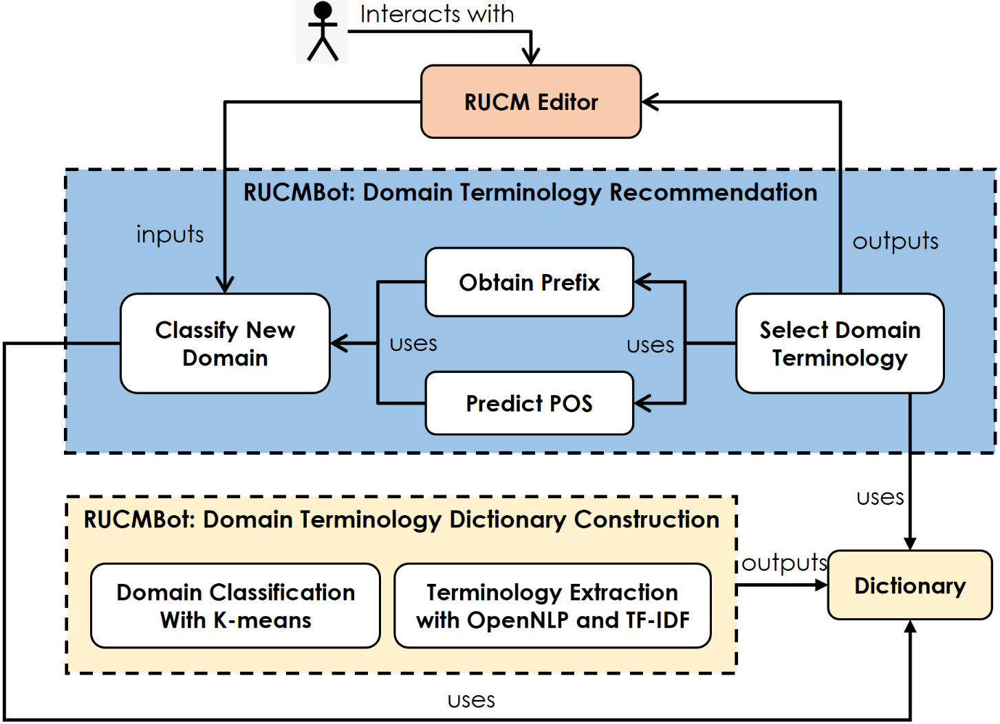

# Intelligent-RUCM：Towards Efficient Use Case Modeling with Automated Domain Classification and Term Recommendation
- [Intelligent-RUCM：Towards Efficient Use Case Modeling with Automated Domain Classification and Term Recommendation](#rucmbot--a-tool-based-on-rucm)
  - [1. Contributions](#1-contributions)
  - [2. Overview](#2-overview)
  - [3. Features of RUCMBot Tool](#3-features-of-rucmbot-tool)
      - [1. Domain Classifier](#1-domain-classifier)
      - [2. Domain Terminology Recommendation](#2-domain-terminology-recommendation)
      - [3. Domain Terminology Dictionary Auto-Construction](#3-domain-terminology-dictionary-auto-construction)
      
## 1. Contributions

1. Designing a model to classify domains automatically at run time when RUCM is used;   
2. Extending OpenNLP Chunker for extracting domain terms to alleviate the problem of the low recall rate in extracting verb phrase (VP) chunks;   
3. Developing a tool, named RUCMBot, which integrates with RUCM to enable efficient use case modeling.

## 2. Overview

An overview of RUCMBot is shown here. It contains two main components: recommending domain terminologies when a user specifies a use case specification with the RUCM editor, and dynamically constructing the dictionary containing identified domain terminologies and their domain classifications. When a user completes her/his work, RUCMBot automatically updates the dictionary by re-clustering and extracting terms, and subsequently realises the self-updating of the dictionary.

## 3. Features of RUCMBot Tool

#### 1. Domain Classifier
RUCM can achieve real-time domain classification based on users input. the index =0 means the use case specification belongs to the domain marked 0 (the labels will be reassigned after re-clustering). 

#### 2. Domain Terminology Recommendation

 RUCMBot can recommend domain terms based on prefixes and the predicted POS of a sentence after the domain classification is successful.
 

#### 3. Domain Terminology Dictionary Auto-Construction

This is part of the domain terminologies dictionary including Domain 0  (Home Automation), Domain 1 (Energy Production) and Domain 2 (Autonomous Driving). Along with the continuous use of RUCM for use case modeling, the dictionary will be self-updating.

